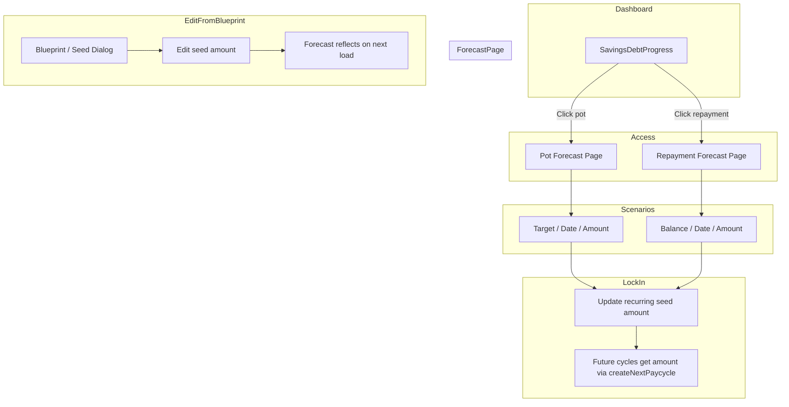

# Forecasting Section for Repayments and Savings

**Updated:** Incorporates user answers on interest, seed source of truth, and native charting choice.

---

## Summary

Introduce a forecasting section where users explore repayment and savings scenarios, view visual projections, and lock in amounts that auto-populate future cycles. Accessible from the Savings & Debt pots on the dashboard, with UX and design best practices applied throughout.

---

## User Decisions (Incorporated)

1. **Interest (repayments):** Include interest as an **optional** feature. Use appropriate disclaimers — PLOT is not FCA-regulated and does not offer financial advice; projections are for planning only. (See COO/Compliance section below.)
2. **Seed source of truth:** Use the **current (active or draft) cycle's** linked seed.
3. **Native charting:** Use **Victory Native** — Skia-based, Reanimated, D3 logic; best-in-class for future-proofing. Ensure compatibility with Expo SDK 54 and `@shopify/react-native-skia` before implementation.

---

## Context

The app has **pots** (savings goals) and **repayments** (debts) shown in the Savings & Debt section on the dashboard. Amounts per cycle come from **seeds** (bills) in Blueprint; seeds link to pots/repayments via `linked_pot_id` and `linked_repayment_id`. Recurring seeds are cloned when the next pay cycle is created. Existing utilities: `suggestedSavingsAmount` and `suggestedRepaymentAmount` in [`suggested-amount.ts`](apps/web/lib/utils/suggested-amount.ts).

---

## Architecture

---

## 1. Interest (Optional) and Compliance

### Interest Calculation (Repayments)
- Add optional interest-rate projection: compound or simple interest per cycle (TBD based on `repayments.interest_rate`).
- Use a toggle: "Include interest in projection" — off by default; when on, show interest assumptions clearly.
- Store `interest_rate` on `repayments`; use it only when the user enables the option.

### COO / Compliance: Disclaimers

**Placement:** In-context within the forecast UI when projections are shown, plus optional expandable "Legal" section.

**Suggested copy (to be reviewed by legal/compliance):**

- **General (always visible near chart):**  
  "Projections are for planning purposes only. PLOT does not provide financial advice."
- **When interest is enabled:**  
  "Interest projections are illustrative and assume rates stay constant. Actual costs may differ. PLOT is not FCA-regulated."
- **Footer / expandable:**  
  "PLOT Budget is a budgeting and planning tool. We do not offer regulated financial advice. You are responsible for your own financial decisions. For debt or savings advice, consider speaking to an FCA-authorised adviser or debt charity."

**Operational:** Document disclaimer placement and wording in a runbook; schedule periodic review (e.g. annual) and when adding new financial projection features.

**Existing terms:** [`apps/marketing/public/terms.html`](apps/marketing/public/terms.html) already states: "PLOT is a budgeting planning tool. It does not provide financial, investment, or legal advice." Align forecast disclaimers with this.

---

## 2. Forecasting Logic (Shared Library)

Extend [`apps/web/lib/utils/suggested-amount.ts`](apps/web/lib/utils/suggested-amount.ts) and add `apps/web/lib/utils/forecast-projection.ts`:

- **`projectSavingsOverTime`** — returns `{ date, balance }[]` per cycle.
- **`projectRepaymentOverTime`** — same for repayments; optional interest when enabled.
- **`cyclesToGoalFromAmount`** (savings).
- **`cyclesToClearFromAmount`** (repayment).
- **`endDateFromCycles`** — convert cycle count to end date.

Reuse `countPayCyclesUntil`, `effectiveStartDate`, and household pay cycle config. Consider moving shared logic to `packages/logic` for native reuse.

---

## 3. Forecast Pages (Web)

- Routes: `/dashboard/forecast/pot/[id]`, `/dashboard/forecast/repayment/[id]`
- Server components load: pot/repayment, household, current paycycle, linked seed(s) for active/draft cycle.
- Scenario controls: target amount, target date, amount per cycle; "Use suggested" button.
- Projection chart: Recharts `LineChart` / `AreaChart` with category colours.
- Lock-in CTA; link to Blueprint for editing amount.
- Disclaimers as per section 1.

---

## 4. Forecast Screens (Native)

- **Pot:** Extend [`apps/native/app/pot-detail/[id].tsx`](apps/native/app/pot-detail/[id].tsx) with a forecast section.
- **Repayment:** Add `apps/native/app/repayment-detail/[id].tsx` and route in `_layout.tsx`.
- **Charts:** Use **Victory Native** (Skia + Reanimated + D3). Verify `victory-native` compatibility with Expo SDK 54 and `@shopify/react-native-skia` before implementation. If conflicts exist (e.g. Skia v1 vs v2), either wait for upstream support or use `react-native-svg` + Reanimated as a temporary fallback.

---

## 5. Access from Dashboard

- **Web:** Make pot and repayment cards in [`SavingsDebtProgress`](apps/web/components/dashboard/savings-debt-progress.tsx) clickable (Link to forecast routes).
- **Native:** Pots already go to pot-detail; add forecast there. Repayments: add Pressable → `router.push(/repayment-detail/{id})`.

---

## 6. Lock-in and Auto-Populate

1. User locks in amount in forecast.
2. Find recurring seed in **active (or draft) cycle** linked to pot/repayment.
3. If exists: `updateSeed(seedId, { amount })`. If not: create seed with `is_recurring: true`.
4. `createNextPaycycleCore` clones recurring seeds with the same amount.

---

## 7. Files to Create or Modify

| Action | Path |
|--------|------|
| Create | `apps/web/lib/utils/forecast-projection.ts` |
| Create | `apps/web/app/dashboard/forecast/pot/[id]/page.tsx` |
| Create | `apps/web/app/dashboard/forecast/repayment/[id]/page.tsx` |
| Create | `apps/web/components/forecast/pot-forecast-client.tsx` |
| Create | `apps/web/components/forecast/repayment-forecast-client.tsx` |
| Create | `apps/web/components/forecast/forecast-chart.tsx` |
| Create | `apps/web/components/forecast/forecast-disclaimer.tsx` |
| Create | `apps/web/lib/actions/forecast-actions.ts` |
| Modify | `apps/web/components/dashboard/savings-debt-progress.tsx` |
| Modify | `apps/native/app/pot-detail/[id].tsx` |
| Create | `apps/native/app/repayment-detail/[id].tsx` |
| Modify | `apps/native/app/_layout.tsx` |
| Modify | `apps/native/app/(tabs)/index.tsx` |
| Install (native) | `victory-native` and `@shopify/react-native-skia` (after compatibility check) |

---

## 8. Native Charting: Victory Native

**Choice:** Victory Native — Skia-based, high-performance, future-proof.

**Caveats:**
- Victory Native v41 uses `@shopify/react-native-skia` v1; Expo SDK 53+ may require Skia v2. Check compatibility with Expo 54 before implementation.
- Install: `npx expo install @shopify/react-native-skia victory-native` (or equivalent).
- If incompatible: document as blocker and use `react-native-svg` + Reanimated for a simpler chart until Victory Native supports current Expo/Skia.
