# PWYL Test Plan – Implementation Strategy

## Current state

- **Checkout:** [apps/web/app/api/checkout/route.ts](apps/web/app/api/checkout/route.ts) – GET handler; supports `product=pwyl` (uses `POLAR_PWYL_BASE_PRODUCT_ID`), `product=monthly`/`annual` (fixed); calls `polar.checkouts.create()` with metadata `household_id`, `user_id`, `pricing_mode`.
- **Webhook:** [apps/web/app/api/webhooks/polar/route.ts](apps/web/app/api/webhooks/polar/route.ts) – POST; validates Polar signature; handles `subscription.created` / `subscription.updated`; upserts `subscriptions` (including PWYL metadata `pwyl_amount`, `pricing_mode`); returns **400** when `household_id` is missing (test plan says “log warning + 200” – see alignment below).
- **Vitest:** [apps/web/vitest.config.ts](apps/web/vitest.config.ts) – only `lib/**/*.test.ts` and `lib/**/*.spec.ts`; no `tests/api` or `tests/emails` yet.
- **Playwright:** [apps/web/playwright.config.ts](apps/web/playwright.config.ts) – projects by feature (chromium-onboarding, chromium-blueprint, etc.); no `pwyl` project or `@pwyl` grep.
- **CI:** [.github/workflows/ci.yml](.github/workflows/ci.yml) – lint, type-check, `test-unit` (Vitest), `test-localhost` (Playwright); no API or email test jobs, no PWYL secrets.
- **Emails:** [apps/web/emails/subscription/pwyl-welcome.tsx](apps/web/emails/subscription/pwyl-welcome.tsx) exists; trial emails in `emails/trial/`. No `__tests__` under `emails/` yet.

---

## Phase 1: Unit/API tests (Vitest)

**Goal:** Cover checkout and webhook handlers with mocks; no real Polar or Supabase.

### 1.1 Config and layout

- **Vitest include:** In [apps/web/vitest.config.ts](apps/web/vitest.config.ts), extend `include` to add `tests/api/**/*.spec.ts` (and later `emails/**/__tests__/**/*.test.ts` or equivalent so email tests are discoverable).
- **API test location:** Use the plan’s paths:
  - `apps/web/tests/api/checkout.pwyl.spec.ts`
  - `apps/web/tests/api/webhooks.polar.spec.ts`

### 1.2 Shared test helpers

- **NextRequest helper:** Utility to build `NextRequest` with `nextUrl` and query params (e.g. `new URL(path + '?' + params, base)` wrapped in `NextRequest`).
- **Invoke handlers:** Call `GET(req)` / `POST(req)` from the route modules; assert on `NextResponse` status, `redirect()` URL, or `json()` body. No need for full Next server; import the route handlers directly.
- **Env:** Use `vi.stubEnv()` (or equivalent) to set `POLAR_ACCESS_TOKEN`, `POLAR_SUCCESS_URL`, `POLAR_PWYL_BASE_PRODUCT_ID`, `POLAR_PREMIUM_PRODUCT_ID`, `POLAR_WEBHOOK_SECRET` per test or `beforeEach`/`afterEach` so tests are isolated.

### 1.3 Mocks

- **Polar SDK:** `vi.mock('@polar-sh/sdk')` (and `@polar-sh/sdk/webhooks` for webhook validation). Provide a mock that:
  - `checkouts.create` returns `{ url: 'https://sandbox.polar.sh/checkout/...' }` for success, or throws for failure.
  - Webhook: either mock `validateEvent` to return a fixed payload (and optionally skip real signature in test by injecting a known secret), or use a precomputed signature with a fixture payload (see [POLAR-TESTING.md](docs/POLAR-TESTING.md)).
- **Supabase:** Mock `@/lib/supabase/admin` (createAdminClient). Use `vi.fn()` for `from('subscriptions').upsert()` and `from('users').update()` so tests assert call counts and arguments (e.g. metadata includes `pwyl_amount`, `pricing_mode`, tier `pro`).

### 1.4 Checkout tests ([tests/api/checkout.pwyl.spec.ts](apps/web/tests/api/checkout.pwyl.spec.ts))

| Case                             | Description                                                                                                                                                                                                                                |
| -------------------------------- | ------------------------------------------------------------------------------------------------------------------------------------------------------------------------------------------------------------------------------------------ |
| **Happy – PWYL**                 | GET with `product=pwyl&household_id=H&user_id=U`; expect Polar `checkouts.create` called with `products: [POLAR_PWYL_BASE_PRODUCT_ID]`, `metadata` includes `household_id`, `user_id`, `pricing_mode: 'pwyl'`; response 302 to mocked URL. |
| **Happy – Fixed monthly**        | `product=monthly`; expect `products: [POLAR_PREMIUM_PRODUCT_ID]`, metadata `pricing_mode: 'fixed'` (or absent per current code).                                                                                                           |
| **Unhappy – Missing product ID** | No `POLAR_PWYL_BASE_PRODUCT_ID` (and product=pwyl) → 400 JSON with message about product ID.                                                                                                                                               |
| **Unhappy – Missing token/URL**  | No `POLAR_ACCESS_TOKEN` or `POLAR_SUCCESS_URL` → 500 JSON.                                                                                                                                                                                 |
| **Unhappy – Polar failure**      | Mock `checkouts.create` to reject; expect 500 JSON with mode info.                                                                                                                                                                         |

### 1.5 Webhook tests ([tests/api/webhooks.polar.spec.ts](apps/web/tests/api/webhooks.polar.spec.ts))

- **Fixtures:** Add `tests/fixtures/polar-webhooks.ts` (or `.json`) with sample `subscription.created` and `subscription.updated` bodies including `metadata: { household_id, user_id, pwyl_amount, pricing_mode }`. Optionally a second fixture with unknown product.
- **Signature:** Either (A) use a fixed test secret and precomputed signature for fixture payloads (recommended for realism), or (B) in test env only allow a bypass header and skip validation to assert parsing/upsert only (faster to implement).
- **Happy – subscription.created (PWYL):** POST fixture with PWYL metadata; assert Supabase `upsert` called with tier `pro` and metadata containing `pwyl_amount`, `pricing_mode`.
- **Happy – subscription.updated (PWYL):** Same payload type; assert upsert path (e.g. same table, correct `polar_subscription_id`).
- **Unhappy – Missing metadata:** Payload without `household_id`. **Alignment:** Current code returns 400. Either (1) keep 400 and assert that in the test, or (2) change handler to log warning and return 200 (graceful) then assert 200 + no DB write. Recommend (1) unless product explicitly wants graceful handling.
- **Unknown product:** Payload with product_id that does not match any env product ID; assert handler returns 200 and either no insert or insert with `current_tier: null` (depending on current `mapTier` behavior).

### 1.6 NPM scripts

- In [apps/web/package.json](apps/web/package.json) add:
  - `"test:api": "vitest run --runInBand tests/api"`
  - `"test:api:watch": "vitest tests/api"`
- Keep existing `test` / `test:unit` so `pnpm test` or `pnpm test:unit` still runs lib tests; CI can run both `test:unit` and `test:api` (or a single `test` that includes api if you expand Vitest include).

---

## Phase 2: Email tests (Vitest)

**Goal:** Assert PWYL and trial emails render correct copy and CTAs without sending mail.

### 2.1 Setup

- **Dependencies:** Ensure `@react-email/render` (or the render used by the app) is available for rendering components to HTML/string.
- **Placement:** Either:
  - `apps/web/emails/subscription/__tests__/pwyl-welcome.test.ts`, and
  - `apps/web/emails/trial/__tests__/ending-soon.test.ts` (and similar for other trial emails),
  or a single `emails/__tests__/` directory with one file per template. Match the plan’s suggestion so it’s discoverable.

### 2.2 What to assert

- **PWYL welcome:** Render [pwyl-welcome.tsx](apps/web/emails/subscription/pwyl-welcome.tsx) with `displayName`, `amount` (e.g. 0 and 3.5). Assert HTML or text includes “Pay-What-You-Like” or “PLOT Premium”, “£3.50” (or “Community Supporter” for amount 0), and CTA link to settings/subscription.
- **Trial emails:** Render ending-soon, grace-reminder, etc.; assert key phrases and blueprint/settings URLs.

### 2.3 Optional send mock

- For “trigger without sending”, mock the Resend (or current provider) client used by the app: `vi.mock('@resend/sdk')` or the wrapper module, and assert that `send` is called with expected to/from/body when the app triggers the email (e.g. from a server action or API). This can live in the same email test file or in an integration-style test under `tests/api` or `lib/`.

### 2.4 Script

- Add `"test:emails": "vitest run tests/emails"` or `"test:emails": "vitest run emails"` (depending on include glob). Ensure Vitest `include` covers the chosen path.

---

## Phase 3: E2E (Playwright) with sandbox

**Goal:** One happy path (visit pricing → Start Premium → sandbox checkout → return to app, verify success/subscription); one controlled unhappy path.

### 3.1 Config and env

- **Playwright project:** Add a `pwyl` (or `chromium-pwyl`) project in [apps/web/playwright.config.ts](apps/web/playwright.config.ts):
  - `testMatch`: e.g. `[/pwyl\.checkout\.spec\.ts/]` or tag `@pwyl`.
  - Load env from a dedicated file if desired: e.g. `.env.test.local.pwyl` (document that this file is gitignored and must provide sandbox credentials). Alternatively reuse `.env.test.local` with sandbox vars.
- **Env vars:** `NEXT_PUBLIC_PWYL_PRICING_ENABLED=true`, `POLAR_ACCESS_TOKEN_SANDBOX`, `POLAR_SUCCESS_URL` (e.g. dev host), `POLAR_PWYL_BASE_PRODUCT_ID_SANDBOX`. Document in test plan or README that these come from GitHub secrets for CI and from `.env.test.local` locally.

### 3.2 Spec and auth

- **New file:** [apps/web/tests/specs/pwyl.checkout.spec.ts](apps/web/tests/specs/pwyl.checkout.spec.ts).
- **Auth:** Reuse existing pattern: either a dedicated auth state (e.g. `pwyl.json`) created in global-setup for a test user with household, or reuse an existing state (e.g. dashboard or blueprint user). Seed user + household via existing [tests/utils/db-cleanup.ts](apps/web/tests/utils/db-cleanup.ts) helpers (e.g. ensure user exists, ensure household so pricing page can pass household_id).

### 3.3 Happy flow (sandbox)

1. Navigate to `/pricing` (log in if needed).
2. Click “Start Premium” (or PWYL CTA that goes to checkout).
3. In Polar sandbox checkout: fill email if required, set amount (e.g. £3.50) via slider/input, use card `4242 4242 4242 4242`, submit.
4. Expect redirect back to app (success URL); assert success toast and/or Settings → Subscription shows PWYL amount (or “Premium” with amount).

### 3.4 Unhappy flow

- **Option A (recommended):** Do not rely on toggling Polar token in E2E. Cover “checkout API returns error” in API unit tests. In E2E, optionally: use a test that sets a missing/invalid product ID via env (e.g. in project config) and assert that after clicking Start Premium the UI shows an error toast or fallback message (requires app to surface API error).
- **Option B:** Use Playwright route interception to abort or mock `/api/checkout` and assert error UI.

### 3.5 Cleanup

- After E2E, optionally delete the created subscription in Supabase (sandbox) via a helper or script so the same user can be reused. Document in test plan.

### 3.6 Script and tag

- Add `"test:e2e:pwyl": "playwright test --project=pwyl"` (or use grep: `playwright test --grep @pwyl`). Plan suggests `test:e2e` with `--grep @pwyl`; decide whether PWYL E2E is a separate script or a tag filter on main `test:e2e`.

---

## Phase 4: CI integration

**Goal:** Run API and email tests on every PR; run PWYL E2E when secrets are available, optionally as allowed-to-fail until stable.

### 4.1 New job: API + email tests

- In [.github/workflows/ci.yml](.github/workflows/ci.yml) (or a new `pwyl-tests.yml` if you prefer a separate file):
  - Job: e.g. `test-pwyl-api`.
  - Steps: checkout, pnpm install, then `pnpm --filter @repo/web run test:api` and `pnpm --filter @repo/web run test:emails` (or single vitest run that includes both via config).
  - No Polar/Supabase secrets required for API/email tests (mocked).

### 4.2 Optional: PWYL E2E job

- Separate job (e.g. `test-pwyl-e2e`) or add to existing `test-localhost` with conditional:
  - Secrets: `POLAR_PWYL_BASE_PRODUCT_ID_SANDBOX`, `POLAR_ACCESS_TOKEN_SANDBOX`, `POLAR_WEBHOOK_SECRET_SANDBOX` (and success URL or base URL).
  - Set `NEXT_PUBLIC_PWYL_PRICING_ENABLED=true` and run Playwright with pwyl project or `--grep @pwyl`.
  - **Recommendation:** Start with `continue-on-error: true` or allow failure so main CI stays green while stabilizing sandbox E2E; remove once flakiness is addressed.

### 4.3 Nightly (optional)

- Cron job to run full E2E (including pwyl) and report via annotations or Slack; can be added later.

---

## Implementation order (recommended)

```mermaid
flowchart LR
  subgraph phase1 [Phase 1]
    A1[Vitest config + include]
    A2[Helpers + mocks]
    A3[Checkout spec]
    A4[Webhook spec + fixtures]
  end
  subgraph phase2 [Phase 2]
    B1[Email render tests]
    B2[test:emails script]
  end
  subgraph phase3 [Phase 3]
    C1[Playwright pwyl project]
    C2[pwyl.checkout.spec]
    C3[Sandbox happy path]
  end
  subgraph phase4 [Phase 4]
    D1[CI API + emails]
    D2[CI E2E optional]
  end
  phase1 --> phase2
  phase2 --> phase3
  phase3 --> phase4
```

1. **Phase 1** – Vitest config, request helpers, Polar + Supabase mocks, checkout and webhook specs, fixtures, `test:api` script. Unblocks CI for API coverage without secrets.
2. **Phase 2** – Email render tests and `test:emails`; extend Vitest include if needed.
3. **Phase 3** – Playwright pwyl project, env loading, `pwyl.checkout.spec.ts` with sandbox happy path (and optional unhappy path). Depends on sandbox credentials and feature flag.
4. **Phase 4** – CI job for API + emails; then optional E2E job with secrets and allowed-to-fail until stable.

---

## Open decisions

| Topic                            | Options                                                         | Recommendation                                                                         |
| -------------------------------- | --------------------------------------------------------------- | -------------------------------------------------------------------------------------- |
| Webhook missing `household_id`   | (1) Keep 400 and test it; (2) Change to log + 200               | Keep 400 and assert in test unless product wants graceful handling.                    |
| E2E in same workflow vs separate | Same as `test-localhost` with env; or separate `pwyl-tests.yml` | Same workflow with conditional run when secrets present; or separate file for clarity. |
| Playwright project name          | `pwyl` vs `chromium-pwyl`                                       | Use `chromium-pwyl` for consistency with existing project naming.                      |

---

## File summary

| Add/change           | Path                                                                                                                                                |
| -------------------- | --------------------------------------------------------------------------------------------------------------------------------------------------- |
| Extend include       | [apps/web/vitest.config.ts](apps/web/vitest.config.ts)                                                                                              |
| Checkout API tests   | [apps/web/tests/api/checkout.pwyl.spec.ts](apps/web/tests/api/checkout.pwyl.spec.ts) (new)                                                          |
| Webhook API tests    | [apps/web/tests/api/webhooks.polar.spec.ts](apps/web/tests/api/webhooks.polar.spec.ts) (new)                                                        |
| Fixtures             | [apps/web/tests/fixtures/polar-webhooks.ts](apps/web/tests/fixtures/polar-webhooks.ts) or `.json` (new)                                             |
| Request helper       | [apps/web/tests/api/helpers/request.ts](apps/web/tests/api/helpers/request.ts) or inline in specs (new)                                             |
| Email tests          | [apps/web/emails/subscription/**tests**/pwyl-welcome.test.ts](apps/web/emails/subscription/__tests__/pwyl-welcome.test.ts), trial `__tests__` (new) |
| E2E spec             | [apps/web/tests/specs/pwyl.checkout.spec.ts](apps/web/tests/specs/pwyl.checkout.spec.ts) (new)                                                      |
| Playwright config    | [apps/web/playwright.config.ts](apps/web/playwright.config.ts) (add project + optional env)                                                         |
| package.json scripts | [apps/web/package.json](apps/web/package.json)                                                                                                      |
| CI                   | [.github/workflows/ci.yml](.github/workflows/ci.yml) or new `pwyl-tests.yml`                                                                        |

This strategy stays aligned with [PWYL-TEST-PLAN.md](docs/PWYL-TEST-PLAN.md) and [POLAR-TESTING.md](docs/POLAR-TESTING.md) while fitting the existing test and CI setup.