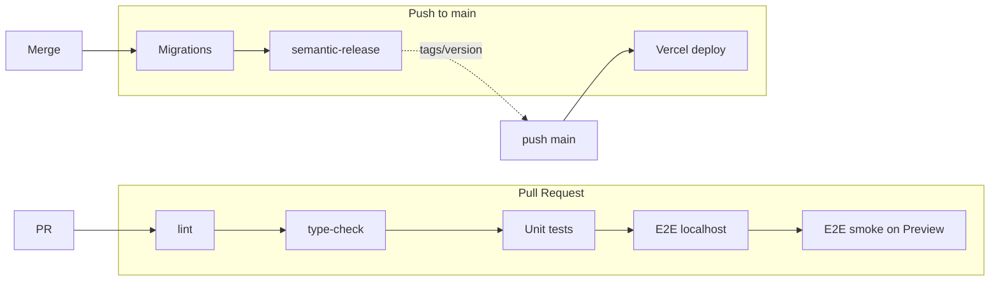

# Deploying PlotBudget to Vercel

PlotBudget deploys to Vercel via **GitHub** (repo linked to Vercel). The app lives in a pnpm monorepo at `apps/web`. Pushing to the linked branch triggers an automatic deploy.

## Environment strategy (two-tier: Preview = Staging)

We use two environments only:

| Tier | When | Vercel | Supabase |
|------|------|--------|----------|
| **Preview (Staging)** | Every PR gets a preview deployment | Vercel Preview URL | A single **non-production** Supabase project (shared by all previews) |
| **Production** | Pushes to `main` | Production Vercel project | **Production** Supabase project only |

- **Preview = Staging:** There is no separate long-lived staging environment. PR preview deployments serve as staging; validate there before merging to `main`.
- **Production** is only from `main`. Production DB is never used by Preview.

### Branching rules

- **`main`** is protected: all changes must go through a Pull Request. Required status checks (lint, type-check, unit tests, E2E on localhost, E2E smoke on Vercel Preview) must pass before merge. No direct push to `main`.
- PRs target `main` and receive a Vercel Preview URL; `main` deploys to Production.

### Data safety

- **Production data never touches non-production.** The production Supabase project is used only by the production app (Vercel production deployment). Preview deployments use a different Supabase project (or a dedicated preview/staging project) with no production data.
- Do not point Preview or any non-production app at the production database. See [OPS_CHECKLIST.md](./OPS_CHECKLIST.md) for one-time Supabase and Vercel setup.

### Pipeline overview

---

## Prerequisites

- Repo linked to Vercel (GitHub integration)
- Supabase project set up (see [spec.md](./spec.md) and [supabase-rls-policies.sql](./supabase-rls-policies.sql))

## 1. Check project settings (monorepo)

In the Vercel project: **Settings → General**:

| Setting | Value |
|--------|--------|
| **Root Directory** | `apps/web` (required so Vercel uses the monorepo correctly) |
| **Framework Preset** | Next.js |

**Build & install** are driven by `apps/web/vercel.json`:

- **Install:** `cd ../.. && pnpm install` (from monorepo root so `@repo/ui` and `@repo/logic` are linked).
- **Build:** `cd ../.. && pnpm turbo build --filter=@repo/web`.

Do **not** override Build Command or Install Command in the UI unless you have a reason; the repo config is correct.

## 2. Environment variables

In the Vercel project: **Settings → Environment Variables**. Add these for **Production** (and Preview if you use the same Supabase project):

| Name | Value | Notes |
|------|--------|------|
| `NEXT_PUBLIC_SUPABASE_URL` | Your Supabase project URL | Supabase Dashboard → Settings → API |
| `NEXT_PUBLIC_SUPABASE_ANON_KEY` | Your Supabase anon/public key | Same place |
| `NEXT_PUBLIC_APP_URL` | Your Vercel URL | e.g. `https://your-project.vercel.app` (optional; for redirects) |
| `NEXT_PUBLIC_APP_ENV` | `production` | Optional; for feature flags or analytics |

**Optional (server-side only):**

| Name | Value | Notes |
|------|--------|------|
| `SUPABASE_SERVICE_ROLE_KEY` | Your Supabase service_role key | Only if you use server-side admin APIs; keep secret |

Do **not** commit these values; set them only in Vercel (and in local `.env.local` for development).

## 3. Supabase auth redirect URLs

In Supabase: **Authentication → URL Configuration**:

- Add your production URL to **Redirect URLs**, e.g.  
  `https://your-project.vercel.app/**`  
  and  
  `https://your-project.vercel.app/auth/callback`
- Set **Site URL** to your production URL if you use it as the main app URL.

## 4. Deploy

Pushes to the linked branch (e.g. `main`) trigger an automatic deploy. After changing env vars or Root Directory, either push a commit or use **Deployments → … → Redeploy** in the Vercel dashboard. The first build may take a few minutes (monorepo install + turbo build).

## 5. Post-deploy checks

- Open the Vercel URL and confirm the app loads.
- Sign up / log in and confirm Supabase auth works (redirect back to the app).
- Run through onboarding and blueprint flows to confirm DB and RLS work.

## Troubleshooting

- **Build fails with “module not found” for `@repo/ui` or `@repo/logic`**  
  Ensure **Root Directory** is `apps/web` and that `vercel.json` is in `apps/web` with the install/build commands above so the full monorepo is installed and built.

- **Redirect loop or auth errors**  
  Check Supabase redirect URLs and `NEXT_PUBLIC_APP_URL` (if used).

- **“Row-level security policy” errors**  
  Apply the policies in `docs/supabase-rls-policies.sql` in the Supabase SQL editor for your project.

## Marketing site and app domains

Decide how users get from the marketing site to the app:

- **Two domains:** Marketing at **plotbudget.com**, app at **app.plotbudget.com**. Marketing CTAs link to `https://app.plotbudget.com/signup` and `/login`. Supabase redirect URLs use the app subdomain.
- **Single domain:** This app is the only site at **plotbudget.com**. Root `/` is the marketing front door; `/signup`, `/login`, `/dashboard` are the app. Supabase redirect URLs use **plotbudget.com**.

See **[MARKETING-APP-INTEGRATION.md](./MARKETING-APP-INTEGRATION.md)** for the full strategy, handoff flows, and implementation checklist.

## Optional: custom domain

In Vercel: **Settings → Domains** → add your domain and follow the DNS instructions.

## Optional: preview deployments

Every branch/PR can get a preview URL. Use the same env vars for Preview if previews should hit the same Supabase project, or add a separate Supabase project and different env vars for Preview.

## Testing the pipeline

To verify the full CI and deployment pipeline: open a PR to `main`. GitHub Actions will run lint, type-check, unit tests, E2E on localhost, and E2E smoke on Vercel Preview. All jobs must pass before merge.
