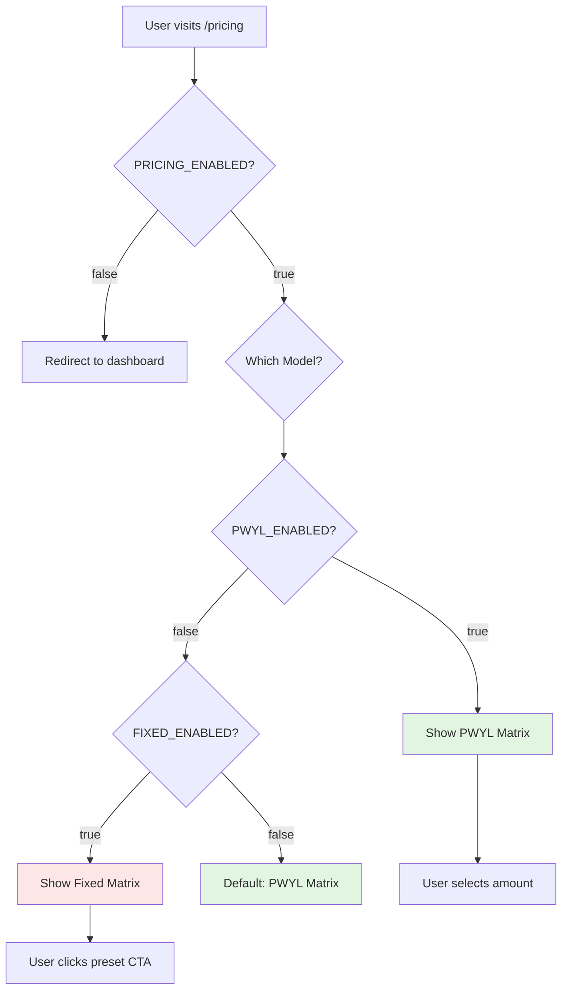
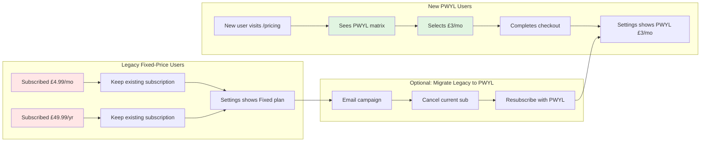
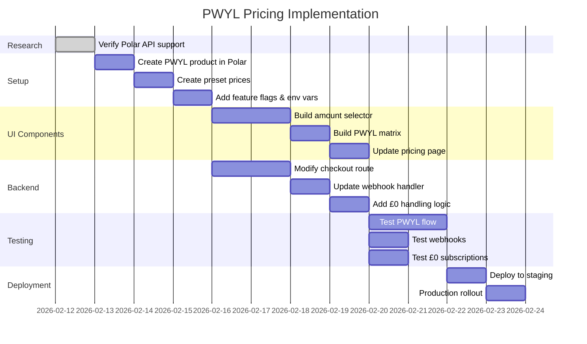

# PWYL Pricing - Architecture Overview

## System Architecture

```mermaid
graph TB
    subgraph User_Flow[User Experience]
        A[Visit /pricing] --> B{Feature Flags}
        B -->|PWYL=true| C[PWYL Matrix]
        B -->|Fixed=true| D[Fixed Matrix Legacy]
        B -->|Neither| C
        
        C --> E[Select Amount<br/>£0-£20 slider]
        E --> F[Presets: £0 £3 £5 £10]
        E --> G[Custom: e.g. £7.50]
        
        F --> H[Click Start Premium]
        G --> H
    end
    
    subgraph Checkout_Logic[Checkout Processing]
        H --> I[/api/checkout?product=pwyl&amount=3.00]
        I --> J{Amount Check}
        
        J -->|£0| K[Skip Polar<br/>Direct DB]
        J -->|Preset| L[Use Price ID]
        J -->|Custom| M[Create Ad-hoc Price]
        
        K --> N[Grant Premium<br/>No Payment]
        L --> O[Polar Checkout]
        M --> O
    end
    
    subgraph Payment_Processing[Payment & Fulfillment]
        O --> P[User Pays<br/>on Polar]
        P --> Q[subscription.created<br/>webhook]
        
        Q --> R[Validate Signature]
        R --> S[Extract Metadata]
        S --> T[Upsert Subscription]
        T --> U[Store PWYL Amount]
        
        N --> V[Create Local Sub]
        V --> U
        
        U --> W[Redirect to<br/>Dashboard Success]
    end
    
    subgraph Settings_Display[Settings Management]
        W --> X[Settings Tab]
        X --> Y{Subscription Type}
        Y -->|PWYL| Z[Show: Premium £3/mo<br/>Change Amount]
        Y -->|Fixed| AA[Show: Premium £4.99/mo<br/>Manage]
        Y -->|Free Premium| AB[Show: Premium Free<br/>Community Supporter]
    end
    
    style C fill:#e1f5e1
    style K fill:#fff3cd
    style N fill:#d1ecf1
    style Z fill:#e1f5e1
```

## Component Hierarchy

```
PricingPage
├── PricingHeaderNavClient
└── [Conditional Rendering]
    ├── PWYLPricingMatrix (when PWYL enabled)
    │   ├── TierCard (Trial)
    │   ├── TierCard (Free)
    │   └── PWYLPremiumCard
    │       ├── PricingAmountSelector
    │       │   ├── PresetButtons [£0 £3 £5 £10]
    │       │   ├── Slider [0-20]
    │       │   └── CustomInput
    │       ├── FeatureList
    │       └── CTAButton → /api/checkout?product=pwyl&amount=X
    │
    └── FixedPricingMatrix (when fixed enabled)
        ├── TierCard (Trial)
        ├── TierCard (Free)
        └── TierCard (Premium £4.99)
```

## Data Flow

### Checkout Request
```
GET /api/checkout?product=pwyl&amount=3.00&household_id=abc&user_id=xyz
```

### Polar Checkout Creation (Option 1: Custom Prices)
```json
{
  "product_price_create": {
    "product_id": "pwyl_base_product_uuid",
    "type": "recurring",
    "recurring_interval": "month",
    "price_amount": 300,
    "price_currency": "GBP"
  },
  "success_url": "https://app.plotbudget.com/dashboard?checkout_id={CHECKOUT_ID}",
  "metadata": {
    "household_id": "abc",
    "user_id": "xyz",
    "pwyl_amount": "3.00",
    "pricing_mode": "pwyl"
  }
}
```

### Polar Checkout Creation (Option 2: Preset Prices)
```json
{
  "products": ["pwyl_price_3_uuid"],
  "success_url": "https://app.plotbudget.com/dashboard?checkout_id={CHECKOUT_ID}",
  "metadata": {
    "household_id": "abc",
    "user_id": "xyz",
    "pwyl_amount": "3.00",
    "pricing_mode": "pwyl"
  }
}
```

### Webhook Payload (subscription.created)
```json
{
  "type": "subscription.created",
  "data": {
    "id": "polar_sub_123",
    "status": "active",
    "product_id": "pwyl_base_product_uuid",
    "price_id": "dynamic_price_uuid",
    "metadata": {
      "household_id": "abc",
      "user_id": "xyz",
      "pwyl_amount": "3.00",
      "pricing_mode": "pwyl"
    }
  }
}
```

### Database Write
```sql
INSERT INTO public.subscriptions (
  household_id,
  polar_subscription_id,
  polar_product_id,
  status,
  current_tier,
  pwyl_amount_gbp  -- New column (optional)
) VALUES (
  'abc',
  'polar_sub_123',
  'pwyl_base_product_uuid',
  'active',
  'pro',
  3.00
);
```

## Feature Flag Decision Tree



## Migration Path for Existing Users



## Implementation Phases


