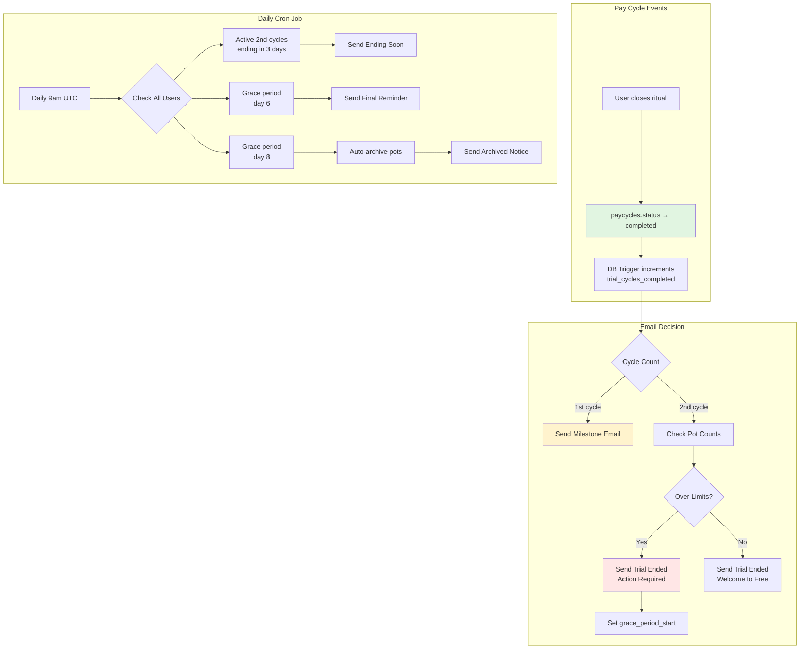

# Trial Period Tracking - Pay Cycle Based

## 🎯 Core Principle

**Trial = First 2 COMPLETED pay cycles** (not time-based)

Each user's pay cycle varies:
- Monthly on 1st: ~30 days
- Last working day: ~28-31 days  
- Every 4 weeks: exactly 28 days

**Therefore**: Trial duration is user-specific, ranging from ~56 to ~62 days depending on their pay schedule.

---

## 📊 Pay Cycle Status Tracking

### Database Schema

**Table**: `public.paycycles`

**Key Fields**:
```sql
id UUID
household_id UUID (FK)
status paycycle_status -- 'active' | 'draft' | 'completed' | 'archived'
ritual_closed_at TIMESTAMPTZ -- When ritual completes, cycle moves to 'completed'
created_at TIMESTAMPTZ
end_date DATE
```

### Trial Logic

```typescript
// Query completed cycle count for a household
SELECT COUNT(*) as completed_cycles
FROM public.paycycles
WHERE household_id = $1
AND status = 'completed';

// Trial status:
// completed_cycles < 2 → In trial
// completed_cycles >= 2 → Trial expired
```

---

## 🔔 Event-Based Email Triggers

### Architecture: Webhook-Driven (Not Cron)

**Trigger Point**: When `paycycles.status` changes to 'completed'

**Implementation**: Database trigger → Supabase Edge Function → Email

```sql
-- Database trigger to call edge function
CREATE OR REPLACE FUNCTION notify_paycycle_completed()
RETURNS TRIGGER AS $$
BEGIN
  -- Only trigger when status changes TO 'completed'
  IF NEW.status = 'completed' AND OLD.status != 'completed' THEN
    -- Call Supabase Edge Function or insert into events table
    PERFORM pg_notify('paycycle_completed', json_build_object(
      'household_id', NEW.household_id,
      'paycycle_id', NEW.id,
      'closed_at', NEW.ritual_closed_at
    )::text);
  END IF;
  RETURN NEW;
END;
$$ LANGUAGE plpgsql;

CREATE TRIGGER paycycle_completed_trigger
AFTER UPDATE ON public.paycycles
FOR EACH ROW
EXECUTE FUNCTION notify_paycycle_completed();
```

---

## 📧 Email Trigger Logic (Revised)

### Email 1: Welcome (Onboarding Complete)
**Trigger**: User completes onboarding
**Logic**: Server action in onboarding flow
**Timing**: Immediate

```typescript
// apps/web/app/onboarding/page.tsx (or wherever onboarding completes)
await sendWelcomeEmail(user);
// No cycle tracking needed
```

---

### Email 2: Trial Milestone (1st Cycle Complete)
**Trigger**: When `paycycles.status` changes to 'completed' for the FIRST time
**Logic**: Database trigger → Edge function → Email
**Timing**: Immediate after ritual completion

```typescript
// Supabase Edge Function: functions/paycycle-completed/index.ts

import { createClient } from '@supabase/supabase-js';
import { Resend } from 'resend';

Deno.serve(async (req) => {
  const { household_id, paycycle_id } = await req.json();
  
  const supabase = createClient(SUPABASE_URL, SUPABASE_SERVICE_KEY);
  
  // Count completed cycles for this household
  const { count: completedCount } = await supabase
    .from('paycycles')
    .select('id', { count: 'exact', head: true })
    .eq('household_id', household_id)
    .eq('status', 'completed');
  
  // First cycle complete → Send milestone email
  if (completedCount === 1) {
    const { data: user } = await supabase
      .from('users')
      .select('email, display_name, id')
      .eq('household_id', household_id)
      .or('id.eq.owner_id')  // Get owner, not partner
      .single();
    
    if (user) {
      await sendTrialMilestoneEmail({
        email: user.email,
        displayName: user.display_name,
        cyclesCompleted: 1,
        totalCycles: 2,
      });
      
      // Mark email sent to avoid duplicates
      await supabase
        .from('user_email_log')
        .insert({
          user_id: user.id,
          email_type: 'trial_milestone',
          sent_at: new Date().toISOString(),
        });
    }
  }
  
  // Second cycle complete → Trial ended email
  if (completedCount === 2) {
    const user = // ... fetch user
    
    // Check if they have excess pots
    const { count: potCount } = await supabase
      .from('pots')
      .select('id', { count: 'exact', head: true })
      .eq('household_id', household_id)
      .is('archived_at', null);
    
    const { count: repaymentCount } = await supabase
      .from('repayments')
      .select('id', { count: 'exact', head: true })
      .eq('household_id', household_id)
      .is('archived_at', null);
    
    // If over limits, send action-required email
    if ((potCount || 0) > 2 || (repaymentCount || 0) > 2) {
      await sendTrialEndedActionRequired({
        email: user.email,
        displayName: user.display_name,
        excessCounts: {
          pots: Math.max(0, (potCount || 0) - 2),
          repayments: Math.max(0, (repaymentCount || 0) - 2),
        },
      });
      
      // Start 7-day grace period
      await supabase
        .from('users')
        .update({
          trial_ended_at: new Date().toISOString(),
          grace_period_start: new Date().toISOString(),
        })
        .eq('id', user.id);
    }
  }
  
  return new Response(JSON.stringify({ success: true }), {
    headers: { 'Content-Type': 'application/json' },
  });
});
```

---

### Email 3: Trial Ending Soon (Before 2nd Cycle Completes)

**Challenge**: How to send "3 days before 2nd cycle ends" when we don't know exactly when it will end?

**Solution**: Estimate based on 1st cycle duration

```typescript
// When 1st cycle completes, schedule "ending soon" email

if (completedCount === 1) {
  const { data: firstCycle } = await supabase
    .from('paycycles')
    .select('created_at, ritual_closed_at')
    .eq('household_id', household_id)
    .eq('status', 'completed')
    .single();
  
  // Calculate actual duration of first cycle
  const cycleStart = new Date(firstCycle.created_at);
  const cycleEnd = new Date(firstCycle.ritual_closed_at);
  const cycleDurationDays = Math.floor(
    (cycleEnd.getTime() - cycleStart.getTime()) / (1000 * 60 * 60 * 24)
  );
  
  // Estimate when 2nd cycle will end
  const estimatedSecondCycleEnd = new Date(
    cycleEnd.getTime() + cycleDurationDays * 24 * 60 * 60 * 1000
  );
  
  // Schedule email for 3 days before estimated end
  const emailSendDate = new Date(
    estimatedSecondCycleEnd.getTime() - 3 * 24 * 60 * 60 * 1000
  );
  
  // Store scheduled email
  await supabase.from('scheduled_emails').insert({
    user_id: user.id,
    email_type: 'trial_ending_soon',
    scheduled_for: emailSendDate.toISOString(),
    metadata: {
      estimated_trial_end: estimatedSecondCycleEnd.toISOString(),
      cycles_completed: 1,
    },
  });
}
```

**Alternative** (simpler): Just send when active cycle is approaching end date

```typescript
// Daily cron job
const { data: activeCycles } = await supabase
  .from('paycycles')
  .select('household_id, end_date')
  .eq('status', 'active');

for (const cycle of activeCycles) {
  const daysUntilEnd = daysBetween(today, cycle.end_date);
  
  // Check if this is the 2nd cycle (trial ending)
  const { count: completedCount } = await supabase
    .from('paycycles')
    .select('id', { count: 'exact', head: true })
    .eq('household_id', cycle.household_id)
    .eq('status', 'completed');
  
  if (completedCount === 1 && daysUntilEnd === 3) {
    // This is the 2nd cycle, ending in 3 days
    await sendTrialEndingSoonEmail(...);
  }
}
```

**Recommended**: Use the simpler daily cron approach tied to `paycycle.end_date`.

---

## 🗓️ Accurate Trial Tracking System

### Schema: Add Trial Tracking Fields

```sql
-- Add to users table
ALTER TABLE public.users
ADD COLUMN trial_started_at TIMESTAMPTZ,
ADD COLUMN trial_cycles_completed INT DEFAULT 0,
ADD COLUMN trial_ended_at TIMESTAMPTZ NULL,
ADD COLUMN is_in_trial BOOLEAN GENERATED ALWAYS AS (
  trial_cycles_completed < 2 AND trial_ended_at IS NULL
) STORED;

-- Update when paycycle completes
CREATE OR REPLACE FUNCTION increment_trial_cycles()
RETURNS TRIGGER AS $$
DECLARE
  owner_user_id UUID;
BEGIN
  IF NEW.status = 'completed' AND OLD.status != 'completed' THEN
    -- Get household owner
    SELECT owner_id INTO owner_user_id
    FROM public.households
    WHERE id = NEW.household_id;
    
    -- Increment trial cycle count
    UPDATE public.users
    SET trial_cycles_completed = trial_cycles_completed + 1
    WHERE id = owner_user_id;
    
    -- If this was cycle 2, mark trial as ended
    UPDATE public.users
    SET trial_ended_at = NEW.ritual_closed_at
    WHERE id = owner_user_id
    AND trial_cycles_completed >= 2
    AND trial_ended_at IS NULL;
    
  END IF;
  RETURN NEW;
END;
$$ LANGUAGE plpgsql;

CREATE TRIGGER update_trial_progress
AFTER UPDATE ON public.paycycles
FOR EACH ROW
EXECUTE FUNCTION increment_trial_cycles();
```

### Email Trigger Using Trial Tracking

```typescript
// Supabase Edge Function or webhook handler

// When paycycle status changes to 'completed'
const { data: user } = await supabase
  .from('users')
  .select('id, email, display_name, trial_cycles_completed, household_id')
  .eq('household_id', household_id)
  .single();

if (user.trial_cycles_completed === 1) {
  // First cycle just completed
  await sendTrialMilestoneEmail({
    email: user.email,
    displayName: user.display_name,
    cyclesCompleted: 1,
    totalCycles: 2,
  });
}

if (user.trial_cycles_completed === 2) {
  // Second cycle just completed → trial expired
  // Check pot counts and send appropriate email
  const { count: potCount } = await supabase
    .from('pots')
    .select('id', { count: 'exact', head: true })
    .eq('household_id', household_id)
    .is('archived_at', null);
  
  if ((potCount || 0) > 2) {
    await sendTrialEndedActionRequiredEmail({
      email: user.email,
      displayName: user.display_name,
      excessPots: (potCount || 0) - 2,
    });
  }
}
```

---

## 🎯 Complete Email Triggering System

### Migration: Add Required Fields

```sql
-- Migration: 20250213_trial_tracking.sql

-- Email tracking log table (avoid duplicate sends)
CREATE TABLE IF NOT EXISTS public.user_email_log (
  id UUID PRIMARY KEY DEFAULT gen_random_uuid(),
  user_id UUID NOT NULL REFERENCES public.users(id) ON DELETE CASCADE,
  email_type TEXT NOT NULL, -- 'trial_milestone', 'trial_ending', 'trial_ended', etc.
  sent_at TIMESTAMPTZ NOT NULL DEFAULT NOW(),
  metadata JSONB, -- Store email-specific data
  
  -- Prevent duplicate emails of same type within short window
  CONSTRAINT unique_email_per_day UNIQUE (user_id, email_type, DATE(sent_at))
);

CREATE INDEX user_email_log_user_id_idx ON public.user_email_log(user_id);
CREATE INDEX user_email_log_type_idx ON public.user_email_log(email_type);

-- Trial tracking on users
ALTER TABLE public.users
ADD COLUMN IF NOT EXISTS trial_started_at TIMESTAMPTZ,
ADD COLUMN IF NOT EXISTS trial_cycles_completed INT DEFAULT 0,
ADD COLUMN IF NOT EXISTS trial_ended_at TIMESTAMPTZ NULL,
ADD COLUMN IF NOT EXISTS grace_period_start TIMESTAMPTZ NULL;

-- Helper function to check if user is in trial
CREATE OR REPLACE FUNCTION is_user_in_trial(user_row public.users)
RETURNS BOOLEAN AS $$
BEGIN
  RETURN user_row.trial_cycles_completed < 2 AND user_row.trial_ended_at IS NULL;
END;
$$ LANGUAGE plpgsql IMMUTABLE;
```

---

## 🔄 Email Triggering Implementation

### Option 1: Supabase Edge Functions (Recommended)

**Pros**: Real-time, event-driven, scalable
**Cons**: Requires Supabase Edge Functions setup

**Flow**:
```
Pay Cycle Ritual Complete
↓
Database: paycycles.status → 'completed'
↓
Database Trigger: pg_notify('paycycle_completed', {...})
↓
Supabase Realtime → Edge Function
↓
Edge Function: Check trial status, send email
```

**File**: `supabase/functions/paycycle-completed/index.ts`

```typescript
import { serve } from 'https://deno.land/std@0.168.0/http/server.ts';
import { createClient } from 'https://esm.sh/@supabase/supabase-js@2';

serve(async (req) => {
  const { household_id, paycycle_id } = await req.json();
  
  const supabase = createClient(
    Deno.env.get('SUPABASE_URL')!,
    Deno.env.get('SUPABASE_SERVICE_ROLE_KEY')!
  );
  
  // Get user and trial status
  const { data: user } = await supabase
    .from('users')
    .select('id, email, display_name, trial_cycles_completed, household_id')
    .eq('household_id', household_id)
    .single();
  
  if (!user) return new Response('User not found', { status: 404 });
  
  // Increment trial cycle count (if DB trigger hasn't already)
  const cyclesCompleted = user.trial_cycles_completed;
  
  // Send appropriate email based on cycle count
  if (cyclesCompleted === 1) {
    await sendEmail(user.email, 'trial_milestone', {
      displayName: user.display_name,
      cyclesCompleted: 1,
      totalCycles: 2,
    });
  }
  
  if (cyclesCompleted === 2) {
    // Trial just ended - check if action needed
    const { count: potCount } = await supabase
      .from('pots')
      .select('id', { count: 'exact', head: true })
      .eq('household_id', household_id)
      .is('archived_at', null);
    
    if ((potCount || 0) > 2) {
      await sendEmail(user.email, 'trial_ended_action_required', {
        displayName: user.display_name,
        excessPots: (potCount || 0) - 2,
      });
    }
  }
  
  return new Response(JSON.stringify({ success: true }), {
    headers: { 'Content-Type': 'application/json' },
  });
});
```

---

### Option 2: Application Webhook (Alternative)

If Supabase Edge Functions aren't viable, use application-level webhook:

**File**: `apps/web/app/api/webhooks/paycycle-completed/route.ts`

```typescript
import { NextRequest, NextResponse } from 'next/server';
import { createAdminClient } from '@/lib/supabase/admin';
import { sendTrialMilestoneEmail, sendTrialEndedEmail } from '@/lib/email/trial-transition';

export async function POST(req: NextRequest) {
  // Verify webhook signature (if calling from external source)
  // Or use internal secret if calling from within PLOT
  
  const { household_id } = await req.json();
  
  const supabase = createAdminClient();
  
  // Count completed cycles
  const { count: completedCycles } = await supabase
    .from('paycycles')
    .select('id', { count: 'exact', head: true })
    .eq('household_id', household_id)
    .eq('status', 'completed');
  
  const { data: user } = await supabase
    .from('users')
    .select('id, email, display_name')
    .eq('household_id', household_id)
    .single();
  
  if (!user) return NextResponse.json({ error: 'User not found' }, { status: 404 });
  
  // Check if we've already sent this email
  const { data: existingLog } = await supabase
    .from('user_email_log')
    .select('id')
    .eq('user_id', user.id)
    .eq('email_type', `trial_cycle_${completedCycles}`)
    .maybeSingle();
  
  if (existingLog) {
    return NextResponse.json({ skipped: 'Already sent' });
  }
  
  // Send appropriate email
  if (completedCycles === 1) {
    await sendTrialMilestoneEmail({
      email: user.email,
      displayName: user.display_name,
      cyclesCompleted: 1,
      totalCycles: 2,
    });
  } else if (completedCycles === 2) {
    await sendTrialEndedEmail({
      email: user.email,
      displayName: user.display_name,
      household_id,
    });
  }
  
  // Log email sent
  await supabase.from('user_email_log').insert({
    user_id: user.id,
    email_type: `trial_cycle_${completedCycles}`,
    sent_at: new Date().toISOString(),
  });
  
  return NextResponse.json({ success: true });
}
```

**Call from ritual completion**:
```typescript
// lib/actions/ritual-actions.ts (wherever cycle is closed)

export async function closeCycle(cycleId: string) {
  // ... existing close cycle logic ...
  
  // After status updated to 'completed'
  await fetch('/api/webhooks/paycycle-completed', {
    method: 'POST',
    headers: { 'Content-Type': 'application/json' },
    body: JSON.stringify({ household_id: cycle.household_id }),
  });
  
  return { success: true };
}
```

---

### Email 3: Trial Ending Soon (Revised Logic)

**Trigger**: Daily cron checks active 2nd cycles nearing end date

```typescript
// app/api/cron/trial-warnings/route.ts

export async function GET(req: Request) {
  const supabase = createAdminClient();
  const today = new Date();
  
  // Find households with 1 completed cycle and 1 active cycle
  const { data: households } = await supabase
    .from('users')
    .select(`
      id,
      email,
      display_name,
      household_id,
      trial_cycles_completed,
      households!inner(
        id,
        paycycles!inner(id, status, end_date)
      )
    `)
    .eq('trial_cycles_completed', 1);
  
  for (const user of households || []) {
    const activeCycle = user.households.paycycles.find(c => c.status === 'active');
    
    if (activeCycle) {
      const daysUntilEnd = daysBetween(today, new Date(activeCycle.end_date));
      
      if (daysUntilEnd === 3) {
        // Check if email already sent
        const { data: log } = await supabase
          .from('user_email_log')
          .select('id')
          .eq('user_id', user.id)
          .eq('email_type', 'trial_ending_soon')
          .maybeSingle();
        
        if (!log) {
          // Get current pot/seed counts
          const counts = await getCurrentCounts(user.household_id);
          
          await sendTrialEndingSoonEmail({
            email: user.email,
            displayName: user.display_name,
            daysRemaining: 3,
            currentCounts: counts,
            freeTierLimits: { pots: 2, repayments: 2, needs: 5, wants: 5 },
          });
          
          await supabase.from('user_email_log').insert({
            user_id: user.id,
            email_type: 'trial_ending_soon',
          });
        }
      }
    }
  }
  
  return NextResponse.json({ processed: households?.length || 0 });
}
```

---

## 📊 Trial Status Dashboard Helper

### Helper Function for Components

```typescript
// lib/utils/trial-status.ts

export interface TrialStatus {
  isInTrial: boolean;
  cyclesCompleted: number;
  totalCycles: number;
  currentCycleEndDate: string | null;
  daysUntilCycleEnd: number | null;
  trialWillExpireAfterCurrentCycle: boolean;
}

export async function getTrialStatus(householdId: string): Promise<TrialStatus> {
  const supabase = createAdminClient();
  
  // Get completed cycle count
  const { count: completedCount } = await supabase
    .from('paycycles')
    .select('id', { count: 'exact', head: true })
    .eq('household_id', householdId)
    .eq('status', 'completed');
  
  // Get active cycle
  const { data: activeCycle } = await supabase
    .from('paycycles')
    .select('end_date')
    .eq('household_id', householdId)
    .eq('status', 'active')
    .maybeSingle();
  
  const cyclesCompleted = completedCount || 0;
  const isInTrial = cyclesCompleted < 2;
  const trialWillExpireAfterCurrentCycle = cyclesCompleted === 1;
  
  let daysUntilCycleEnd: number | null = null;
  if (activeCycle?.end_date) {
    const endDate = new Date(activeCycle.end_date);
    const today = new Date();
    daysUntilCycleEnd = Math.ceil((endDate.getTime() - today.getTime()) / (1000 * 60 * 60 * 24));
  }
  
  return {
    isInTrial,
    cyclesCompleted,
    totalCycles: 2,
    currentCycleEndDate: activeCycle?.end_date || null,
    daysUntilCycleEnd,
    trialWillExpireAfterCurrentCycle,
  };
}
```

**Usage in Dashboard**:
```tsx
// app/dashboard/page.tsx

const trialStatus = await getTrialStatus(householdId);

return (
  <>
    {trialStatus.isInTrial && (
      <TrialProgressBanner
        cyclesCompleted={trialStatus.cyclesCompleted}
        daysUntilEnd={trialStatus.daysUntilCycleEnd}
        isLastCycle={trialStatus.trialWillExpireAfterCurrentCycle}
      />
    )}
    {/* ... rest of dashboard ... */}
  </>
);
```

---

## ✅ Revised Email Trigger System

### Summary Table

| Email | Trigger Event | Timing | Implementation |
|-------|---------------|--------|----------------|
| Welcome | Onboarding complete | Immediate | Server action |
| Milestone | `paycycles.status` → 'completed' (1st time) | Immediate | DB trigger → Edge function |
| Ending Soon | Active cycle with `end_date` in 3 days + 1 cycle completed | Daily cron | Scheduled check |
| Trial Ended | `paycycles.status` → 'completed' (2nd time) | Immediate | DB trigger → Edge function |
| Grace Reminder | 7 days after trial_ended_at | Daily cron | Scheduled check |
| Pots Archived | After auto-archive runs | Immediate | After archive script |

### Implementation Decision

**Recommended Stack**:
1. **Database Trigger** → increment `trial_cycles_completed`
2. **Supabase Edge Function** → send milestone/ended emails immediately
3. **Daily Cron** → send "ending soon" and grace period emails

**Fallback** (if Edge Functions not available):
1. **Database Trigger** → increment `trial_cycles_completed`
2. **Server Action** → send email when ritual closes (called from frontend)
3. **Daily Cron** → all time-based emails

---

## 🧪 Testing Trial Emails with Actual Cycles

### Test Scenario Setup

**Create Test User with Controlled Pay Cycles**:

```sql
-- Insert test user
INSERT INTO public.users (id, email, display_name, household_id, trial_started_at, trial_cycles_completed)
VALUES ('test-user-id', 'test@plotbudget.test', 'Test User', 'test-household-id', NOW(), 0);

-- Insert test household
INSERT INTO public.households (id, owner_id, ...)
VALUES ('test-household-id', 'test-user-id', ...);

-- Insert first completed pay cycle
INSERT INTO public.paycycles (
  household_id, 
  status, 
  start_date, 
  end_date, 
  ritual_closed_at
)
VALUES (
  'test-household-id',
  'completed',
  NOW() - INTERVAL '30 days',
  NOW() - INTERVAL '1 day',
  NOW() - INTERVAL '1 day'
);

-- Verify: trial_cycles_completed should auto-increment to 1
SELECT trial_cycles_completed FROM public.users WHERE id = 'test-user-id';
-- Should return: 1

-- Verify: Milestone email should have been triggered
SELECT * FROM public.user_email_log
WHERE user_id = 'test-user-id' AND email_type = 'trial_milestone';
```

### Test Email Sequence

```bash
# 1. Complete first cycle (manually update status)
UPDATE public.paycycles
SET status = 'completed', ritual_closed_at = NOW()
WHERE household_id = 'test-household-id'
AND status = 'active';

# → Verify: Milestone email sent

# 2. Create second active cycle
INSERT INTO public.paycycles (household_id, status, end_date, ...)
VALUES ('test-household-id', 'active', NOW() + INTERVAL '30 days', ...);

# 3. Wait for cron or manually trigger "ending soon" email
# (set end_date to NOW() + 3 days to trigger)

# 4. Complete second cycle
UPDATE public.paycycles
SET status = 'completed', ritual_closed_at = NOW()
WHERE household_id = 'test-household-id'
AND status = 'active';

# → Verify: Trial ended email sent
# → Verify: trial_ended_at is set
# → Verify: grace_period_start is set

# 5. Test grace period reminder (set grace_period_start to 6 days ago)
UPDATE public.users
SET grace_period_start = NOW() - INTERVAL '6 days'
WHERE id = 'test-user-id';

# Run cron manually
# → Verify: Grace reminder email sent

# 6. Test auto-archiving (set grace_period_start to 8 days ago)
UPDATE public.users
SET grace_period_start = NOW() - INTERVAL '8 days'
WHERE id = 'test-user-id';

# Run enforcement script
# → Verify: Pots archived
# → Verify: Archive notification email sent
```

---

## 📝 Updated Email Content (Cycle-Aware)

### Email 2: Trial Milestone (Revised)

**Subject**: "PLOT Update - You've completed your 1st pay cycle!"

**Content**:
```
Hi [Name],

Great news - you've just completed your first pay cycle with PLOT! 🎉

Your Trial Progress:
✓ Pay Cycle 1: Complete
◯ Pay Cycle 2: In progress (ends on [ACTUAL_END_DATE])

After your next pay cycle completes:
You'll transition to one of these options:

Free Tier (Forever Free):
• 2 savings pots
• 2 repayments  
• 5 bills/needs, 5 wants

Premium (Pay What You Like):
• Unlimited pots
• Pay £0-£10/month (you choose)
• Our suggested contribution: £3/month

Your Current Setup:
- [X] savings pots (Free tier limit: 2)
- [X] repayments (Free tier limit: 2)

[View Your Options →]

Questions? Reply anytime.

PLOT Team
```

### Email 3: Trial Ending Soon (Cycle-Aware)

**Subject**: "Your 2nd pay cycle ends on [DATE] - Choose your plan"

**Content**:
```
Hi [Name],

Your final trial pay cycle ends on [ACTUAL_END_DATE] (in ~[X] days).

Trial Status:
✓ Pay Cycle 1: Complete
◯ Pay Cycle 2: Ends [DATE]

Your Current Pots:
• [X] savings goals (Free tier allows 2)
• [X] repayments (Free tier allows 2)
• [X] bills/needs (Free tier allows 5)
• [X] wants (Free tier allows 5)

⚠️ You have [Y] pots over the free tier limit.

Before [DATE], decide:

Option 1: Stay on Free Tier
[Reduce to 2 Pots →]
- Archive your least important pots
- Keep your top 2 priorities
- Always free, no payment needed

Option 2: Upgrade to Premium (PWYL)
[Choose Your Contribution →]
- Keep all your pots (unlimited)
- Pay what feels fair: £0-£10/month
- Suggested: £3/month

Option 3: Wait and See
- After [DATE], you'll have 7 days to reduce pots
- Then excess pots are auto-archived (not deleted)
- You can restore them anytime by upgrading

[Manage Pots →]  [View Pricing →]

Your next pay cycle ends: [ACTUAL_END_DATE]

PLOT Team
```

**Key Improvement**: Uses actual `end_date` from active paycycle, not estimated days.

---

## 🎯 Final Implementation Architecture

### Email Trigger Flow



### Implementation Files

**Event-Based** (immediate emails):
```
supabase/functions/
└── paycycle-completed/
    └── index.ts          # Triggered when cycle completes
    
OR

apps/web/app/api/webhooks/
└── paycycle-completed/
    └── route.ts          # Called from ritual close action
```

**Scheduled** (time-based emails):
```
apps/web/app/api/cron/
└── trial-warnings/
    └── route.ts          # Daily check for ending-soon and grace period
```

**Email Templates**:
```
apps/web/emails/
└── trial/
    ├── milestone.tsx           # After 1st cycle
    ├── ending-soon.tsx         # 3 days before 2nd cycle ends
    ├── ended-action-required.tsx    # After 2nd cycle (over limits)
    ├── ended-welcome-free.tsx       # After 2nd cycle (within limits)
    ├── grace-reminder.tsx           # Day 6 of grace period
    └── pots-archived.tsx            # After auto-archiving
```

---

## ✅ Accurate Cycle-Based Email System

**Key Advantages**:
- ✅ Emails tied to actual cycle completions (not time estimates)
- ✅ Works for all pay schedule types (monthly, 4-week, last working day)
- ✅ Uses real `end_date` from paycycles table
- ✅ Respects user's unique pay schedule
- ✅ No assumptions about cycle duration

**Trade-offs**:
- "Ending Soon" email requires daily cron (can't predict exact cycle end)
- Relies on users actually completing rituals (closing cycles)
- If user doesn't close ritual, cycle status won't update

**Mitigation for Unclosed Cycles**:
```typescript
// Auto-close cycles that pass end_date without ritual
// Daily cron also handles this

if (activeCycle.end_date < today && activeCycle.status === 'active') {
  // Auto-close with warning
  await supabase
    .from('paycycles')
    .update({ 
      status: 'completed',
      ritual_closed_at: activeCycle.end_date, // Use end date as close date
    })
    .eq('id', activeCycle.id);
  
  // Send "you missed your ritual" email
  // Still count as completed cycle for trial purposes
}
```

---

**Trial email system now based on actual pay cycle completions, not time estimates. Emails triggered by real cycle events and user-specific end dates.**
